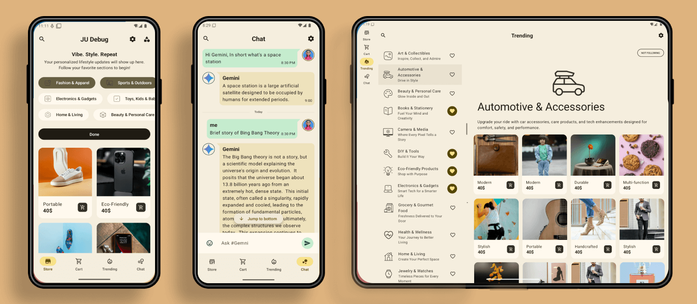

<a href="https://github.com/AshishMK/JetUpdates/releases/download/V1.0.37/app-prod-release.apk"></a>

JetUpdates App
==================

**Learn how this app was designed and built in
the [Theme builder](https://material-foundation.github.io/material-theme-builder/), [architecture learning journey](docs/ArchitectureLearningJourney.md)
and [modularization learning journey](docs/ModularizationLearningJourney.md).**

==================
It is a **work in progress** 🚧.
==================

**JetUpdates** is a fully functional Android app built entirely with Kotlin and Jetpack Compose. It
follows Android design and development best practices and is intended to be a useful reference
for developers. As a running app, it's intended to help developers keep up-to-date with the world
of Android development by providy ing regular news updates.

The app is currently in development. The `prodRelease` variant is here [Download APK](https://github.com/AshishMK/JetUpdates/releases/download/V1.0.37/app-prod-release.apk).

# Features

**JetUpdates** displays content for an **E-Commerce** APP Users can browse for
different categories for the content. Users can also follow categories they are interested
in, and be notified when new item is published which matches interests they are following.

## Screenshots



# Development Environment

**JetUpdates** uses the Gradle build system and can be imported directly into Android Studio (make
sure you are using the latest stable version
available [here](https://developer.android.com/studio)).

Change the run configuration to `app`.


Once you're up and running, you can refer to the learning journeys below to get a better
understanding of which libraries and tools are being used, the reasoning behind the approaches to
UI, testing, architecture and more, and how all of these different pieces of the project fit
together to create a complete app.

# Architecture

The **JetUpdates** app follows the
[official architecture guidance](https://developer.android.com/topic/architecture)
and is described in detail in the
[architecture learning journey](docs/ArchitectureLearningJourney.md).

# Modularization

The **JetUpdates** app has been fully modularized and you can find the detailed guidance and
description of the modularization strategy used in
[modularization learning journey](docs/ModularizationLearningJourney.md).

# Build

The app contains the usual `debug` and `release` build variants.

In addition, the `benchmark` variant of `app` is used to test startup performance and generate a
baseline profile (see below for more information).

`app-nia-catalog` is a standalone app that displays the list of components that are stylized for
**JetUpdates**.

Currently this app uses static local data to allow immediate building and exploring of the UI.

For normal development use the `demoDebug` variant. For UI performance testing use the
`demoRelease` variant.

# Testing

To facilitate testing of components, **JetUpdates** uses dependency injection with
[Hilt](https://developer.android.com/training/dependency-injection/hilt-android).

Most data layer components are defined as interfaces.
Then, concrete implementations (with various dependencies) are bound to provide those interfaces to
other components in the app.
In tests, **JetUpdates** notably does _not_ use any mocking libraries.
Instead, the production implementations can be replaced with test doubles using Hilt's testing APIs
(or via manual constructor injection for `ViewModel` tests).

These test doubles implement the same interface as the production implementations and generally
provide a simplified (but still realistic) implementation with additional testing hooks.
This results in less brittle tests that may exercise more production code, instead of just verifying
specific calls against mocks.

Examples:

- In instrumentation tests, a temporary folder is used to store the user's preferences, which is
  wiped after each test.
  This allows using the real `DataStore` and exercising all related code, instead of mocking the
  flow of data updates.

- There are `Test` implementations of each repository, which implement the normal, full repository
  interface and also provide test-only hooks.
  `ViewModel` tests use these `Test` repositories, and thus can use the test-only hooks to
  manipulate the state of the `Test` repository and verify the resulting behavior, instead of
  checking that specific repository methods were called.

To run the tests execute the following gradle tasks:

- `testDemoDebug` run all local tests against the `demoDebug` variant. Screenshot tests will fail
  (see below for explanation). To avoid this, run `recordRoborazziDemoDebug` prior to running unit
  tests.
- `connectedDemoDebugAndroidTest` run all instrumented tests against the `demoDebug` variant.

> [!NOTE]
> You should not run `./gradlew test` or `./gradlew connectedAndroidTest` as this will execute
> tests against _all_ build variants which is both unnecessary and will result in failures as only the
`demoDebug` variant is supported. No other variants have any tests (although this might change in
> future).

## Screenshot tests

A screenshot test takes a screenshot of a screen or a UI component within the app, and compares it
with a previously recorded screenshot which is known to be rendered correctly.

For example, JetUpdates
has [screenshot tests](https://github.com/android/nowinandroid/blob/main/app/src/testDemo/kotlin/com/google/samples/apps/nowinandroid/ui/NiaAppScreenSizesScreenshotTests.kt)
to verify that the navigation is displayed correctly on different screen sizes
([known correct screenshots](https://github.com/android/nowinandroid/tree/main/app/src/testDemo/screenshots)).

JetUpdates uses [Roborazzi](https://github.com/takahirom/roborazzi) to run screenshot tests
of certain screens and UI components. When working with screenshot tests the following gradle tasks
are useful:

- `verifyRoborazziDemoDebug` run all screenshot tests, verifying the screenshots against the known
  correct screenshots.
- `recordRoborazziDemoDebug` record new "known correct" screenshots. Use this command when you have
  made changes to the UI and manually verified that they are rendered correctly. Screenshots will be
  stored in `modulename/src/test/screenshots`.
- `compareRoborazziDemoDebug` create comparison images between failed tests and the known correct
  images. These can also be found in `modulename/src/test/screenshots`.

> [!NOTE]
> **Note on failing screenshot tests**   
> The known correct screenshots stored in this repository are recorded on CI using Linux. Other
> platforms may (and probably will) generate slightly different images, making the screenshot tests
> fail.
> When working on a non-Linux platform, a workaround to this is to run `recordRoborazziDemoDebug` on
> the
`main` branch before starting work. After making changes, `verifyRoborazziDemoDebug` will identify
> only
> legitimate changes.

For more information about screenshot testing
[check out this talk](https://www.droidcon.com/2023/11/15/easy-screenshot-testing-with-compose/).

# UI

The app was designed using [Material 3 guidelines](https://m3.material.io/). Learn more about the
design process and
obtain the design files in
the  [Theme builder](https://material-foundation.github.io/material-theme-builder/),.

The Screens and UI elements are built entirely
using [Jetpack Compose](https://developer.android.com/jetpack/compose).

The app has two themes:

- Dynamic color - uses colors based on
  the [user's current color theme](https://material.io/blog/announcing-material-you) (if supported)
- Default theme - uses predefined colors when dynamic color is not supported

Each theme also supports dark mode.

The app uses adaptive layouts to
[support different screen sizes](https://developer.android.com/guide/topics/large-screens/support-different-screen-sizes).

Find out more about the [UI architecture here](docs/ArchitectureLearningJourney.md#ui-layer).

# Performance

## Benchmarks

Find all tests written using [
`Macrobenchmark`](https://developer.android.com/topic/performance/benchmarking/macrobenchmark-overview)
in the `benchmarks` module. This module also contains the test to generate the Baseline profile.

## Baseline profiles

The baseline profile for this app is located at [
`app/src/main/baseline-prof.txt`](app/src/main/baseline-prof.txt).
It contains rules that enable AOT compilation of the critical user path taken during app launch.
For more information on baseline profiles,
read [this document](https://developer.android.com/studio/profile/baselineprofiles).

> [!NOTE]
> The baseline profile needs to be re-generated for release builds that touch code which changes app
> startup.

To generate the baseline profile, select the `benchmark` build variant and run the
`BaselineProfileGenerator` benchmark test on an AOSP Android Emulator.
Then copy the resulting baseline profile from the emulator to [
`app/src/main/baseline-prof.txt`](app/src/main/baseline-prof.txt).

## Compose compiler metrics

Run the following command to get and analyse compose compiler metrics:

```bash
./gradlew assembleRelease -PenableComposeCompilerMetrics=true -PenableComposeCompilerReports=true
```

The reports files will be added to [build/compose-reports](build/compose-reports). The metrics files
will also be
added to [build/compose-metrics](build/compose-metrics).

For more information on Compose compiler metrics,
see [this blog post](https://medium.com/androiddevelopers/jetpack-compose-stability-explained-79c10db270c8).

# License

**JetUpdates** is distributed under the terms of the Apache License (Version 2.0). See the
[license](LICENSE) for more information.
