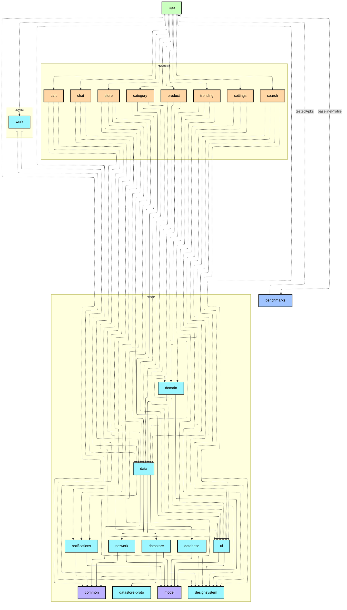
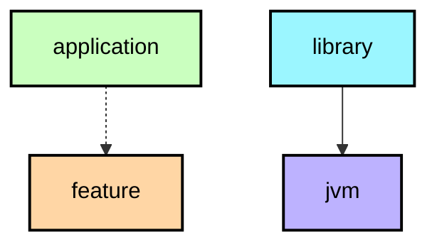

# `:app`

## Module dependency graph

<!--region graph-->

```mermaid
---
config:
  layout: elk
  elk:
    nodePlacementStrategy: SIMPLE
---
graph TB
  subgraph :core
    direction TB
    :core:common[common]:::jvm-library
    :core:data[data]:::android-library
    :core:database[database]:::android-library
    :core:datastore[datastore]:::android-library
    :core:datastore-proto[datastore-proto]:::android-library
    :core:designsystem[designsystem]:::android-library
    :core:domain[domain]:::android-library
    :core:model[model]:::jvm-library
    :core:network[network]:::android-library
    :core:notifications[notifications]:::android-library
    :core:ui[ui]:::android-library
  end
  subgraph :feature
    direction TB
    :feature:cart[cart]:::android-feature
    :feature:category[category]:::android-feature
    :feature:chat[chat]:::android-feature
    :feature:product[product]:::android-feature
    :feature:search[search]:::android-feature
    :feature:settings[settings]:::android-feature
    :feature:store[store]:::android-feature
    :feature:trending[trending]:::android-feature
  end
  subgraph :sync
    direction TB
    :sync:work[work]:::android-library
  end
  :benchmarks[benchmarks]:::android-test
  :app[app]:::android-application

  :app -.->|baselineProfile| :benchmarks
  :app -.-> :core:common
  :app -.-> :core:data
  :app -.-> :core:ui
  :app -.-> :feature:cart
  :app -.-> :feature:category
  :app -.-> :feature:chat
  :app -.-> :feature:product
  :app -.-> :feature:search
  :app -.-> :feature:settings
  :app -.-> :feature:store
  :app -.-> :feature:trending
  :app -.-> :sync:work
  :benchmarks -.->|testedApks| :app
  :core:data --> :core:common
  :core:data --> :core:database
  :core:data --> :core:datastore
  :core:data --> :core:network
  :core:data -.-> :core:notifications
  :core:database --> :core:model
  :core:datastore -.-> :core:common
  :core:datastore --> :core:datastore-proto
  :core:datastore --> :core:model
  :core:domain --> :core:data
  :core:domain --> :core:model
  :core:network --> :core:common
  :core:network --> :core:model
  :core:notifications -.-> :core:common
  :core:notifications --> :core:model
  :core:ui --> :core:designsystem
  :core:ui --> :core:model
  :feature:cart -.-> :core:data
  :feature:cart -.-> :core:designsystem
  :feature:cart -.-> :core:ui
  :feature:category -.-> :core:data
  :feature:category -.-> :core:designsystem
  :feature:category --> :core:ui
  :feature:category -.-> :core:ui
  :feature:chat -.-> :core:data
  :feature:chat -.-> :core:designsystem
  :feature:chat -.-> :core:ui
  :feature:product -.-> :core:data
  :feature:product -.-> :core:designsystem
  :feature:product -.-> :core:ui
  :feature:search -.-> :core:data
  :feature:search -.-> :core:designsystem
  :feature:search -.-> :core:domain
  :feature:search -.-> :core:ui
  :feature:settings -.-> :core:data
  :feature:settings -.-> :core:designsystem
  :feature:settings -.-> :core:ui
  :feature:store -.-> :core:data
  :feature:store -.-> :core:designsystem
  :feature:store -.-> :core:domain
  :feature:store -.-> :core:notifications
  :feature:store -.-> :core:ui
  :feature:trending -.-> :core:data
  :feature:trending -.-> :core:designsystem
  :feature:trending -.-> :core:domain
  :feature:trending -.-> :core:ui
  :sync:work -.-> :core:data
  :sync:work -.-> :core:notifications

classDef android-application fill:#CAFFBF,stroke:#000,stroke-width:2px,color:#000;
classDef android-feature fill:#FFD6A5,stroke:#000,stroke-width:2px,color:#000;
classDef android-library fill:#9BF6FF,stroke:#000,stroke-width:2px,color:#000;
classDef android-test fill:#A0C4FF,stroke:#000,stroke-width:2px,color:#000;
classDef jvm-library fill:#BDB2FF,stroke:#000,stroke-width:2px,color:#000;
classDef unknown fill:#FFADAD,stroke:#000,stroke-width:2px,color:#000;
```

📋 Graph legend

```mermaid
graph TB
  application[application]:::android-application
  feature[feature]:::android-feature
  library[library]:::android-library
  jvm[jvm]:::jvm-library

  application -.-> feature
  library --> jvm

classDef android-application fill:#CAFFBF,stroke:#000,stroke-width:2px,color:#000;
classDef android-feature fill:#FFD6A5,stroke:#000,stroke-width:2px,color:#000;
classDef android-library fill:#9BF6FF,stroke:#000,stroke-width:2px,color:#000;
classDef android-test fill:#A0C4FF,stroke:#000,stroke-width:2px,color:#000;
classDef jvm-library fill:#BDB2FF,stroke:#000,stroke-width:2px,color:#000;
classDef unknown fill:#FFADAD,stroke:#000,stroke-width:2px,color:#000;
```

<!--endregion-->
