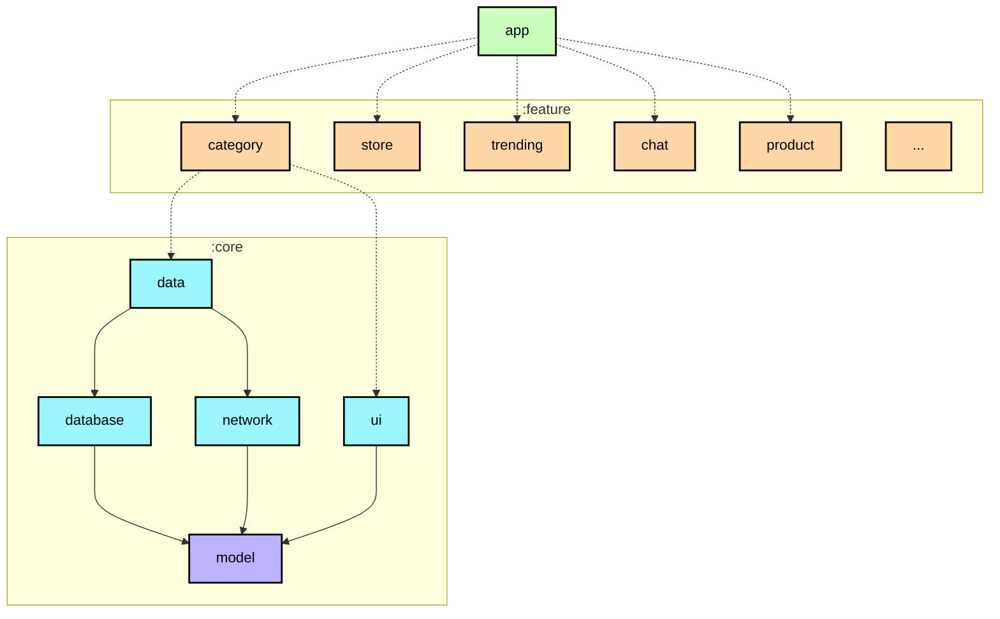
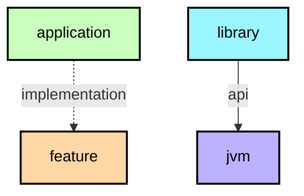

# Modularization learning journey

In this learning journey you will learn about the modularization strategy used
to create modules in the Now in Android app. For the theory behind modularization, check out
[the official guidance](https://developer.android.com/topic/modularization).

**IMPORTANT:** Every module has a dependency graph in its README ([example for the app module](https://github.com/android/nowinandroid/tree/main/app)) which can be useful for understanding the overall structure of the project.

## Module types

📋 Graph legend

**Top tip**: A module graph (shown above) can be useful during modularization planning for
visualizing dependencies between modules.

The Now in Android app contains the following types of modules:

### The `app` module
This contains app level and scaffolding classes that bind the rest of the codebase, such as
`MainActivity`, `JuApp` and app-level controlled navigation. A good example of this is the navigation setup through `AppNavHost` and the bottom navigation bar setup through `TopLevelDestination`. The `app` module depends on all `feature` modules and required `core` modules.

### Feature modules
These are feature-specific modules that handle a single responsibility in the app. For example, the `Store` feature handles all content and UI state for the "Store" screen. Feature modules aren't Gradle modules themselves, they are split into two submodules:

* `api` - contains navigation keys
* `impl` - contains everything else

This approach allows features to navigate to other features by using the target feature's navigation keys. A feature's `api` and `impl` modules can be used by any app, including test or other flavoured apps. If a class is needed only by one feature module, it should remain within that module. If not, it should be placed into an appropriate `core` module.

A feature's `api` module should not depend on another feature's `api` or `impl` module. A feature's `impl` should only depend on another feature's `api` module. Both submodules should only depend on the `core` modules that they require.

### Core modules
These are common library modules containing auxiliary code and specific dependencies that
need to be shared between other modules in the app. These modules can depend on other core
modules, but they shouldn’t depend on feature nor app modules.

### Miscellaneous modules
For example, `sync`, `benchmark` and `test` modules, as well as `app-ju-catalog` - a catalog app for displaying our design system quickly.

## Examples

<table>
  <tr>
   <td><strong>Name</strong>
   </td>
   <td><strong>Responsibilities</strong>
   </td>
   <td><strong>Key classes and good examples</strong>
   </td>
  </tr>
  <tr>
   <td><code>app</code>
   </td>
   <td>Brings everything together required for the app to function correctly. This includes UI scaffolding and navigation. 
   </td>
   <td><code>NiaApp, MainActivity</code> 
   App-level controlled navigation via <code>AppNavHost, JUAppState, TopLevelDestination</code>
   </td>
  </tr>
  <tr>
   <td><code>feature:1:api,</code> 
   <code>feature:2:api</code> 
   ...
   </td>
   <td>Navigation keys and functions that other features can use to navigate to this feature.  
   For example: The <code>:category:api</code> module exposes a <code>Navigator.navigateToCategory</code> function that the
   <code>:trending:impl</code> module uses to navigate from the <code>TrendingScreen</code> to the <code>CategoryScreen</code> when
   a category is clicked. 
   </td>
   <td><code>CategoryNavKey</code>
   </td>
  </tr>
  <tr>
   <td><code>feature:1:impl,</code> 
   <code>feature:2:impl</code> 
   ...
   </td>
   <td>Functionality associated with a specific feature or user journey. Typically contains UI components and ViewModels which read data from other modules. 
   Examples include: 
   <ul>
      <li><a href="https://github.com/android/jetupdates/tree/main/feature/category/impl"><code>feature:category:impl</code></a> displays information about a category on the TopicScreen.</li>
      <li><a href="https://github.com/android/jetupdates/tree/main/feature/store/impl"><code>feature:store:impl</code></a> which displays the shop item list, and onboarding during first run, on the Store screen.</li>
      </ul>
   </td>
   <td><code>CategoryScreen</code> 
   <code>CategoryViewModel</code>
   </td>
  </tr>
  <tr>
   <td><code>core:data</code>
   </td>
   <td>Fetching app data from multiple sources, shared by different features.
   </td>
   <td><code>CategoriesRepository</code> 
   </td>
  </tr>
  <tr>
   <td><code>core:designsystem</code>
   </td>
   <td>Design system which includes Core UI components (many of which are customized Material 3 components), app theme and icons. The design system can be viewed by running the <code>app-nia-catalog</code> run configuration. 
   </td>
   <td>
   <code>AppIcons</code>    <code>AppButton</code>    <code>AppTheme</code> 
   </td>
  </tr>
  <tr>
   <td><code>core:ui</code>
   </td>
   <td>Composite UI components and resources used by feature modules, such as the Shop Item feed. Unlike the <code>designsystem</code> module, it is dependent on the data layer since it renders models, like shop item. 
   </td>
   <td> <code>ShopList</code> <code>ShopItemCardExpanded</code>
   </td>
  </tr>
  <tr>
   <td><code>core:common</code>
   </td>
   <td>Common classes shared between modules.
   </td>
   <td><code>AppDispatchers</code> 
   <code>Result</code>
   </td>
  </tr>
  <tr>
   <td><code>core:network</code>
   </td>
   <td>Making network requests and handling responses from a remote data source.
   </td>
   <td><code>RetrofitAppNetworkApi</code>
   </td>
  </tr>
  <tr>
   <td><code>core:testing</code>
   </td>
   <td>Testing dependencies, repositories and util classes.
   </td>
   <td><code>AppTestRunner</code> 
   <code>TestDispatcherRule</code>
   </td>
  </tr>
  <tr>
   <td><code>core:datastore</code>
   </td>
   <td>Storing persistent data using DataStore.
   </td>
   <td><code>AppPreferences</code> 
   <code>UserPreferencesSerializer</code>
   </td>
  </tr>
  <tr>
   <td><code>core:database</code>
   </td>
   <td>Local database storage using Room.
   </td>
   <td><code>AppDatabase</code> 
   <code>DatabaseMigrations</code> 
   <code>Dao</code> classes
   </td>
  </tr>
  <tr>
   <td><code>core:model</code>
   </td>
   <td>Model classes used throughout the app.
   </td>
   <td><code>Category</code> 
   <code>Episode</code> 
   <code>ShopItem</code>
   </td>
  </tr>
</table>

## Dependency graphs
Each module has its own `README.md` file containing a module graph (e.g. [`:app` module graph](../app/README.md#module-dependency-graph)).  
When modules dependencies change, module graphs are automatically updated by the [Build.yaml](../.github/workflows/Build.yaml) workflow.  
You can also manually update the graphs by running the `graphUpdate` task.

## Further considerations

Our modularization approach was defined taking into account the "JetUpdates” project roadmap, upcoming work and new features. Additionally, our aim this time around was to find the right balance between overmodularizing a relatively small app and using this opportunity to showcase a modularization pattern fit for a much larger codebase, closer to real world apps in production environments.

This approach was discussed with the Android community, and evolved taking their feedback into account. With modularization however, there isn’t one right answer that makes all others wrong. Ultimately, there are many ways and approaches to modularizing an app and rarely does one approach fit all purposes, codebases and team preferences. This is why planning beforehand and taking into account all goals, problems you’re trying to solve, future work and predicting potential stepping stones are all crucial steps for defining the best fit structure under your own, unique circumstances. Developers can benefit from a brainstorming session to draw out a graph of modules and dependencies to visualize and plan this better.

Our approach is such an example - we don’t expect it to be an unchangeable structure applicable to all cases, and in fact, it could evolve and change in the future. It’s a general guideline we found to be the best fit for our project and offer it as one example you can further modify, expand and build on top of. One way of doing this would be to increase the granularity of the codebase even more. Granularity is the extent to which your codebase is composed of modules. If your data layer is small, it’s fine to keep it in a single module. But once the number of repositories and data sources starts to grow, it might be worth considering splitting them into separate modules.

We are also always open to your constructive feedback - learning from the community and exchanging ideas is one of the key elements to improving our guidance.

